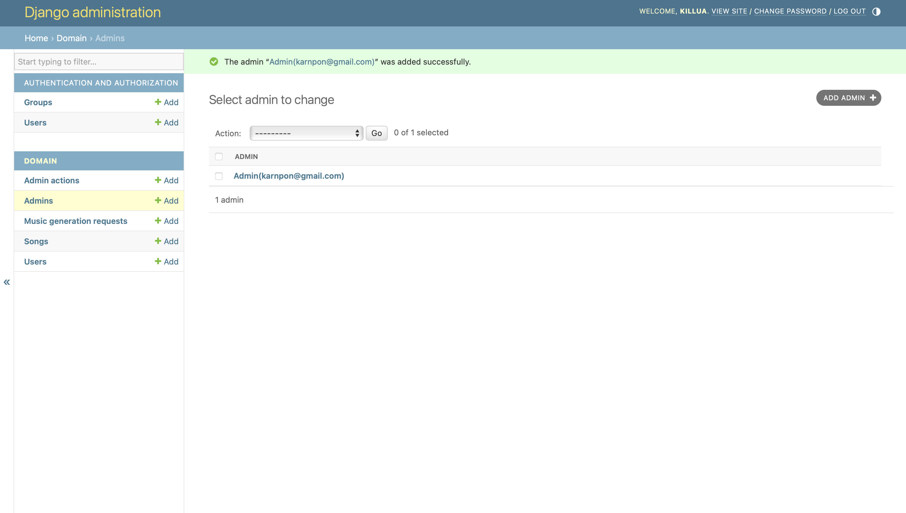
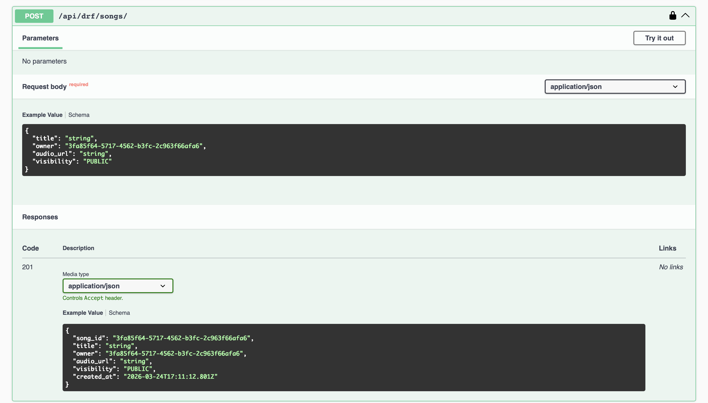
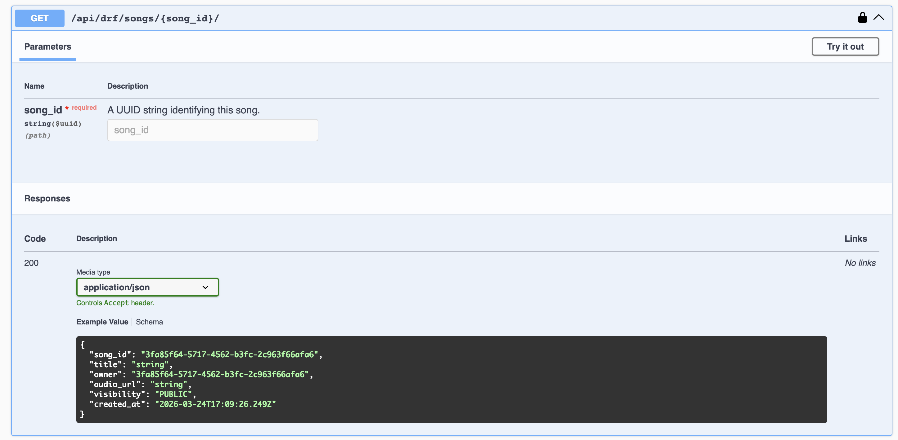
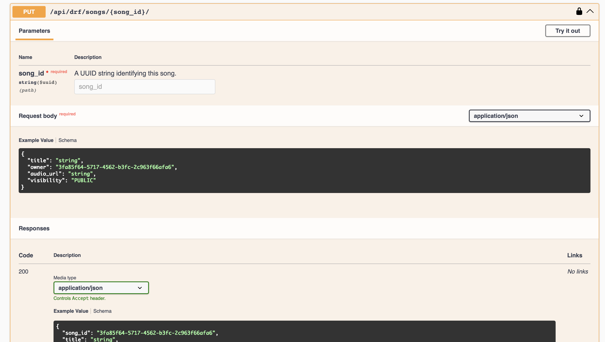
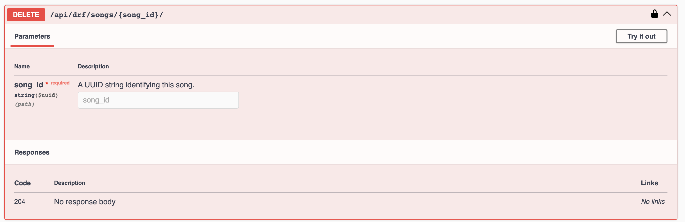

# AI Music Generation Web Application

> A production-minded Django foundation for building the next wave of AI-powered music creation.


## Project Vision

This project is the backend core of an **AI Music Generation Platform** designed to evolve into a complete web product where users can:

- Generate music from prompts or style presets
- Manage generated tracks in personal workspaces
- Preview, iterate, and export results
- Collaborate and share creations online

Current repository state is an initial Django scaffold, prepared for structured expansion.
The project supports Django 5.x and 6.x for class use and no longer pins the older 4.2 release.

## Domain Model Diagram

This diagram shows the current domain model used in the project.


## Recent Changes

### 1) Django dependency updated

The repository originally pinned `Django==4.2.29` in `requirements.txt`.
That was changed to support `Django>=5,<7` because the class uses Django 5.x or 6.x, and the project setup already aligns better with newer Django versions.

### 2) Removed generation status enum

The `Generation` status enum was removed from the model design.
This was an intentional simplification because that status felt too implementation-specific and not essential to the core domain model.

Instead of storing a dedicated generation status enum, the current model keeps the request structure focused on the actual request data and completion result, such as:

- `song_name`
- `genre`
- `mood`
- `singer_style`
- `description`
- `completed_at`
- `produced_song`

## Quick Start

### 1) Create virtual environment

```bash
python -m venv .venv
source .venv/bin/activate
```

### 2) Install dependencies

```bash
pip install -r requirements.txt
```

This installs a Django version in the supported `5.x` to `6.x` range.

### 3) Run database migrations

```bash
python manage.py migrate
```

### 4) Create admin account (optional)

```bash
python manage.py createsuperuser
```

### 5) Start development server

```bash
python manage.py runserver
```

Open:

- `http://127.0.0.1:8000/` redirects to API docs
- `http://127.0.0.1:8000/admin/`

## Public API

The project now exposes CRUD endpoints outside Django Admin.

Postman-style song endpoints are also available for demo and presentation use.
The project also includes Django REST Framework docs pages for browser-based API exploration.

- `GET, POST /api/users/`
- `GET, PUT, DELETE /api/users/<uuid>/`
- `GET, POST /api/admins/`
- `GET, PUT, DELETE /api/admins/<uuid>/`
- `GET, POST /api/songs/`
- `GET, PUT, DELETE /api/songs/<uuid>/`
- `GET, POST /api/requests/`
- `GET, PUT, DELETE /api/requests/<uuid>/`
- `GET, POST /api/admin-actions/`
- `GET, PUT, DELETE /api/admin-actions/<uuid>/`

### Postman-style Song Endpoints

- `GET /songs/`
- `POST /songs/create/`
- `GET /songs/<uuid>/`
- `DELETE /songs/<uuid>/delete/`
- `PATCH /songs/<uuid>/visibility/`

### DRF Docs and Browsable API

- `GET /api/docs/` Swagger UI
- `GET /api/redoc/` ReDoc
- `GET /api/schema/` OpenAPI schema
- `GET /api/drf/` DRF browsable API root
- `GET, POST /api/drf/songs/`
- `GET, PUT, PATCH, DELETE /api/drf/songs/<uuid>/`

Example:

```bash
curl -X POST http://127.0.0.1:8000/api/users/ \
  -H "Content-Type: application/json" \
  -d '{"email":"demo@example.com","account_status":"ACTIVE"}'
```

Song example:

```bash
curl -X POST http://127.0.0.1:8000/songs/create/ \
  -H "Content-Type: application/json" \
  -d '{"title":"Zen Song","owner":"<user_uuid>","audio_url":"https://example.com/song.mp3","visibility":"PRIVATE"}'
```

## Development Workflow

```bash
# activate environment
source .venv/bin/activate

# run migrations after model changes
python manage.py makemigrations
python manage.py migrate

# run local server
python manage.py runserver
```

## CRUD Overview

### Django Admin CRUD

#### Create

Create records through the Django Admin interface.


#### Read

Read and inspect stored records through the Django Admin interface.



#### Update

Update existing records through the Django Admin interface.


#### Delete

Delete records through the Django Admin interface.


### API CRUD

#### Create

Create records through the exposed API endpoints.



#### Read

Read records through the exposed API endpoints and documentation tools.



#### Update

Update records through the exposed API endpoints.



#### Delete

Delete records through the exposed API endpoints.



## License

This project is licensed under the MIT License.  
See [LICENSE](LICENSE) for details.

